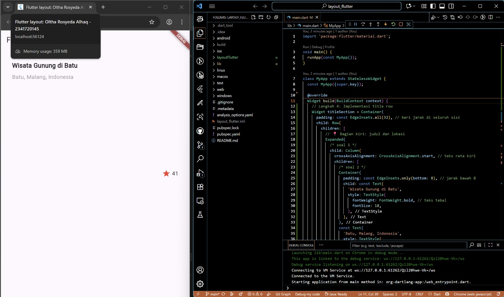
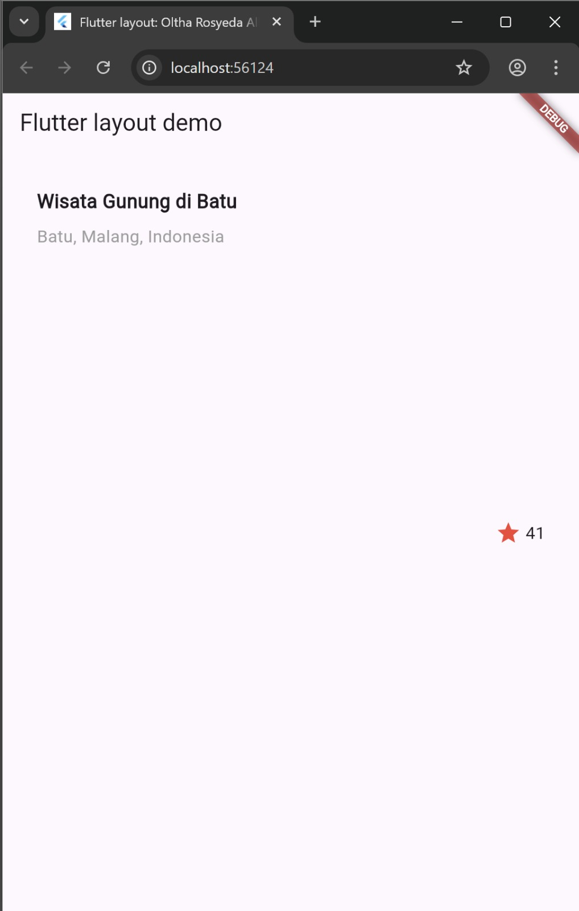
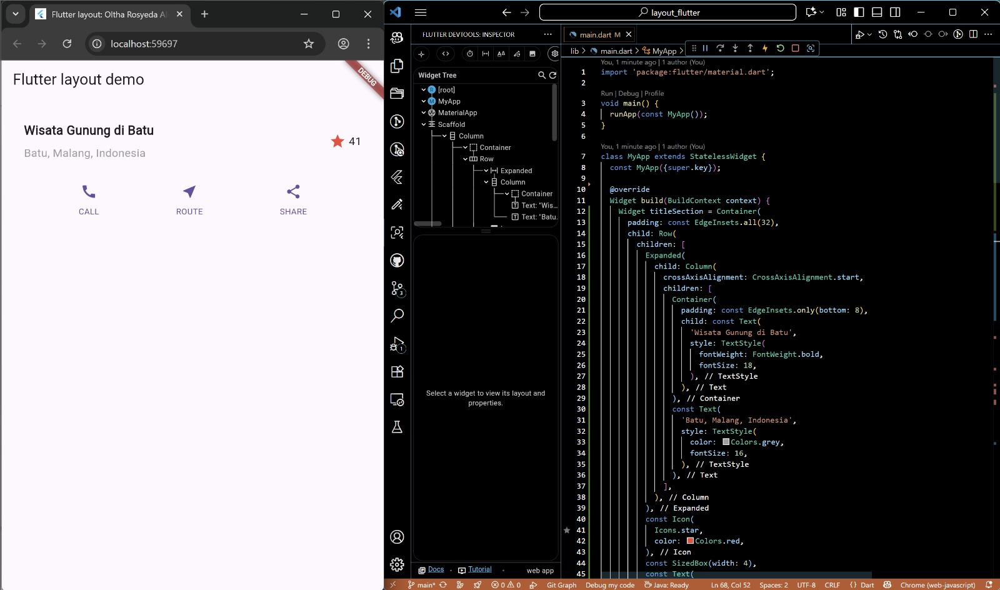
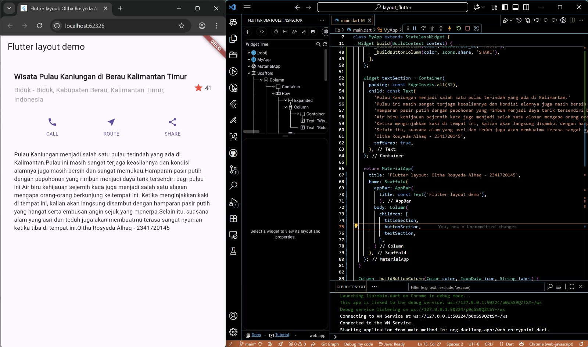
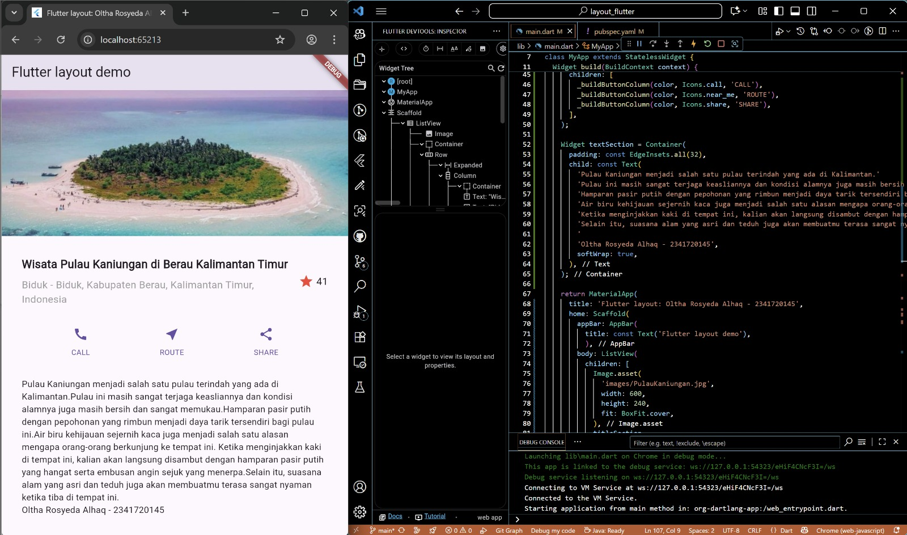

# layout_flutter

A new Flutter project.

## Getting Started

This project is a starting point for a Flutter application.

A few resources to get you started if this is your first Flutter project:

- [Lab: Write your first Flutter app](https://docs.flutter.dev/get-started/codelab)
- [Cookbook: Useful Flutter samples](https://docs.flutter.dev/cookbook)

For help getting started with Flutter development, view the
[online documentation](https://docs.flutter.dev/), which offers tutorials,
samples, guidance on mobile development, and a full API reference.

# 📱 Praktikum Flutter Layout

Repositori ini berisi hasil **Praktikum 1 - 4** dari mata kuliah **Pemrograman Mobile** menggunakan **Flutter**.  
Setiap praktikum menampilkan hasil layout berbeda dengan penjelasan singkat.

---

## 🧪 Praktikum 1

Pada praktikum ini dibuat layout dasar Flutter yang menampilkan judul dan lokasi wisata.

---

  
full view.

---

## 🧪 Praktikum 2
  
Layout ditambahkan dengan ikon interaktif dan teks deskripsi singkat tentang lokasi wisata.

---

## 🧪 Praktikum 3
  
Halaman dikembangkan dengan menambahkan kolom teks panjang dan tombol interaksi.

---

## 🧪 Praktikum 4
  
Layout akhir menampilkan gambar, deskripsi lengkap, serta ikon yang berfungsi pada tampilan utama.

---
