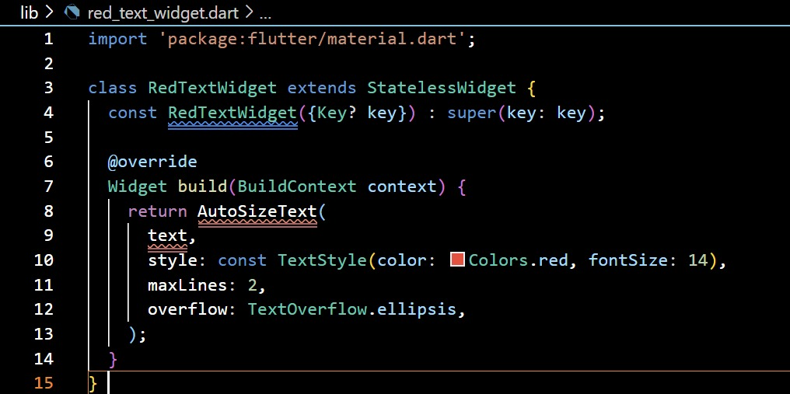
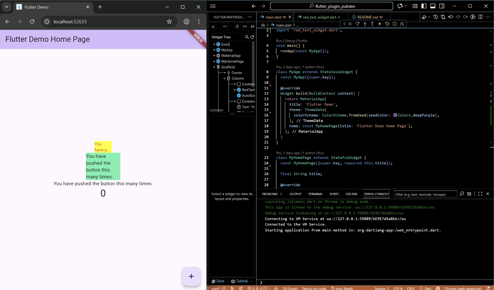
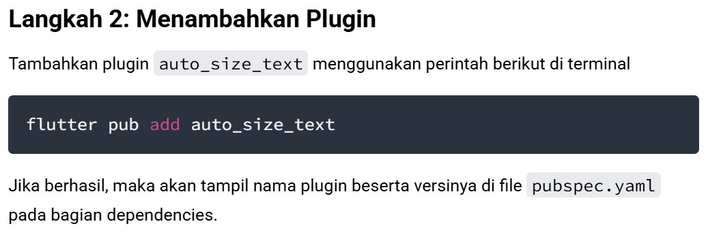
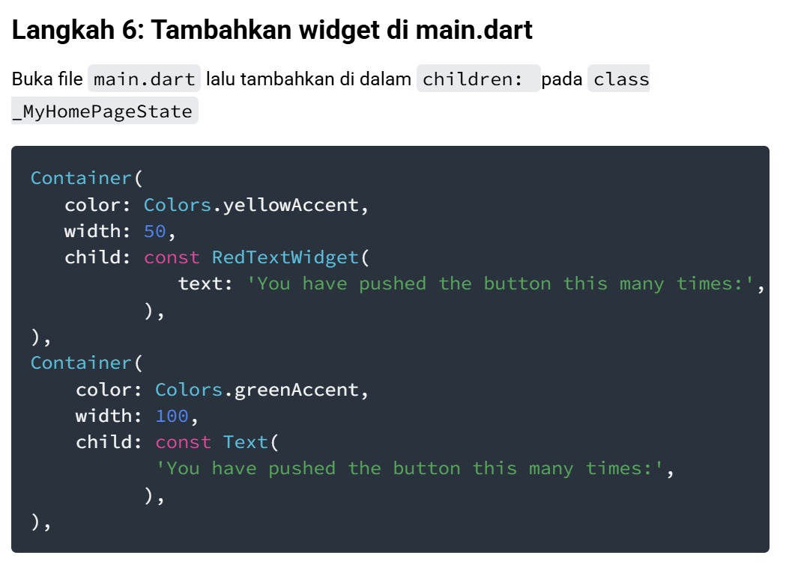

# flutter_plugin_pubdev

A new Flutter project.

## Getting Started

This project is a starting point for a Flutter application.

A few resources to get you started if this is your first Flutter project:

- [Lab: Write your first Flutter app](https://docs.flutter.dev/get-started/codelab)
- [Cookbook: Useful Flutter samples](https://docs.flutter.dev/cookbook)

For help getting started with Flutter development, view the
[online documentation](https://docs.flutter.dev/), which offers tutorials,
samples, guidance on mobile development, and a full API reference.

# PRAKTIKUM - Menerapkan Plugin di Project Flutter
# Langkah 4 : Tambah Widget AutoSize Text
Terdapat error pada langkah ini.

Error terjadi karena widget menggunakan AutoSizeText tetapi package auto_size_text belum diimpor, sehingga Flutter tidak mengenali kelas tersebut. Selain itu, variabel text tidak didefinisikan dalam widget, sehingga menyebabkan error saat dipanggil.

# Output 

# TUGAS PRAKTIKUM
1. Jelaskan maksud dari langkah 2 pada praktikum tersebut!

Maksud dari langkah 2 adalah agar project Flutter bisa menggunakan plugin auto_size_text. Perintah flutter pub add auto_size_text akan otomatis menambahkan dependensi auto_size_text ke dalam file pubspec.yaml pada bagian dependencies, lalu menjalankan flutter pub get agar library tersebut diunduh dan siap dipakai. Dengan begitu, kita bisa mengimpor package:auto_size_text/auto_size_text.dart dan menggunakan widget AutoSizeText di dalam project.

2. Jelaskan maksud dari langkah 5 pada praktikum tersebut!

Langkah 5 di lakukan agar widget RedTextWidget bisa menerima data teks dari luar ketika dipanggil. Dengan menambahkan final String text; , kita membuat properti di dalam class yang menyimpan nilai teks. Lalu constructor const RedTextWidget({Key? key, required this.text}) digunakan untuk mewajibkan pengguna widget mengisi parameter text saat memanggilnya. Hal ini penting agar AutoSizeText di dalam widget bisa menampilkan teks sesuai input yang diberikan, bukan sekadar nilai statis

3. Pada langkah 6 terdapat dua widget yang ditambahkan, jelaskan fungsi dan perbedaannya!
   - Widget pertama menggunakan RedTextWidget yang di dalamnya memanfaatkan AutoSizeText. Fungsinya menampilkan teks berwarna merah dengan ukuran font yang bisa menyesuaikan otomatis agar tidak melebihi batas lebar container, serta memotong teks dengan ellipsis jika terlalu panjang.
   - Widget kedua menggunakan Text biasa yang hanya menampilkan teks standar tanpa penyesuaian ukuran otomatis. Perbedaan utamanya adalah RedTextWidget memberi gaya khusus (warna merah, auto resize, dan ellipsis) sedangkan Text menampilkan teks polos sesuai properti default yang diberikan.

4. maksud dari tiap parameter yang ada di dalam plugin auto_size_text berdasarkan tautan pada dokumentasi ini !
   - key — key untuk widget, mengontrol bagaimana widget diganti di tree (umumnya sama seperti key di widget lain)
   - textKey — key khusus untuk widget Text internal yang dihasilkan oleh AutoSizeText
   - style — TextStyle dasar yang digunakan sebagai acuan (termasuk ukuran font) sebelum penyesuaian otomatis
   - minFontSize — ukuran font terkecil yang diizinkan ketika AutoSizeText mengecilkan teks agar muat; jika teks tak muat di bawah ini, maka overflow yang menangani
   - maxFontSize — ukuran font maksimum yang diperbolehkan selama penyesuaian otomatis; berguna untuk membatasi agar tidak terlalu besar
   - stepGranularity — seberapa besar langkah pengurangan ukuran font setiap iterasi ketika mencoba mengecilkan teks; semakin kecil nilai langkah, semakin presisi namun bisa berdampak performa
   - presetFontSizes — daftar ukuran font yang diperbolehkan; jika parameter ini diisi, maka minFontSize, maxFontSize, dan stepGranularity diabaikan
   - group — objek AutoSizeGroup untuk menyinkronkan ukuran font antar banyak AutoSizeText agar mereka memakai ukuran efektif yang sama
   - textAlign — mengatur perataan horizontal teks (seperti TextAlign pada widget Text)
   - textDirection — menentukan arah teks (LTR / RTL), yang mempengaruhi interpretasi start / end
   - locale — menentukan lokal (misalnya bahasa/negara) yang bisa mempengaruhi pemilihan glyph/font saat rendering
   - softWrap — apakah teks boleh membungkus di titik-titik pemutusan baris “lunak” (soft line breaks)
   - wrapWords — menentukan apakah kata-kata yang tidak muat dalam satu baris boleh dibungkus ke baris berikutnya; secara default true agar berperilaku seperti Text normal
   - overflow — mengatur bagaimana tampilan ketika teks melebihi batas (misalnya ellipsis)
   - overflowReplacement — widget alternatif yang ditampilkan jika teks tetap overflow dan tidak bisa dijadikan ukuran yang wajar via auto-resize
   - textScaleFactor — faktor skala tambahan untuk ukuran font, juga mempengaruhi rentang minFontSize, maxFontSize, dan presetFontSizes
   - maxLines — batas maksimal jumlah baris yang diizinkan; AutoSizeText akan menyesuaikan ukuran agar teks tetap dalam jumlah baris ini
   - semanticsLabel — label semantik alternatif (aksesibilitas) yang bisa digunakan oleh screen reader, berbeda dari teks visual jika diperlukan