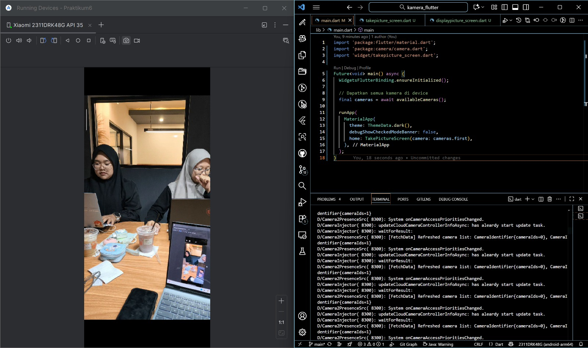
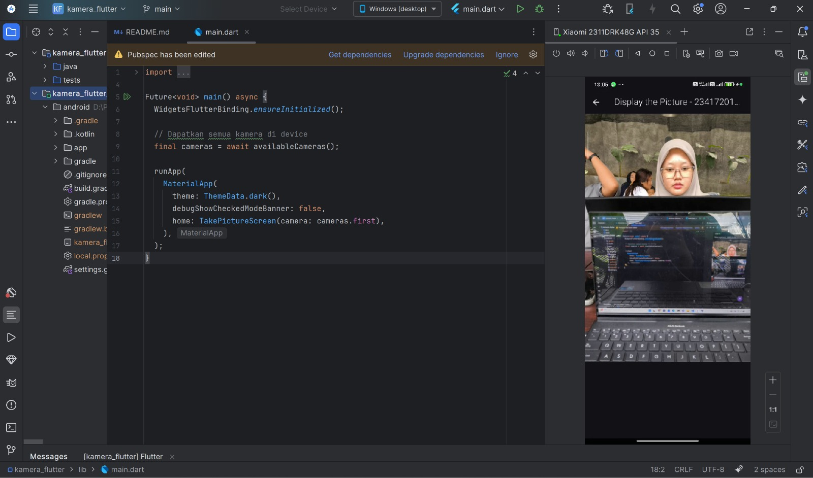
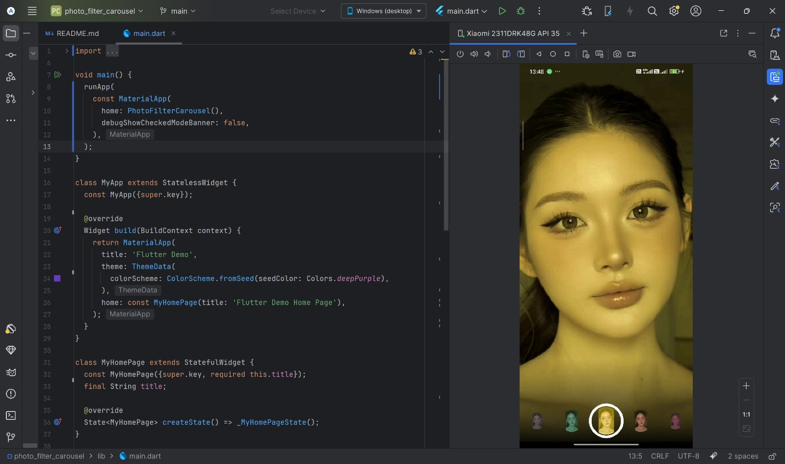
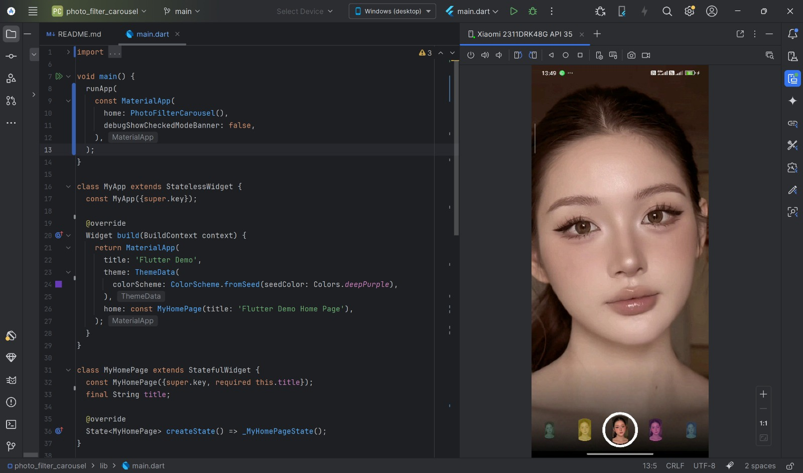
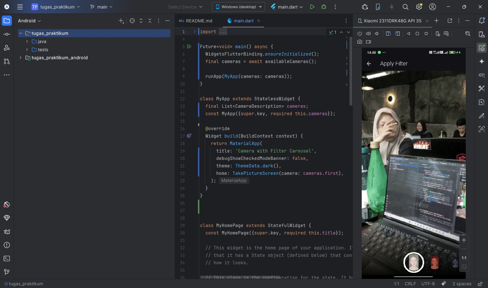
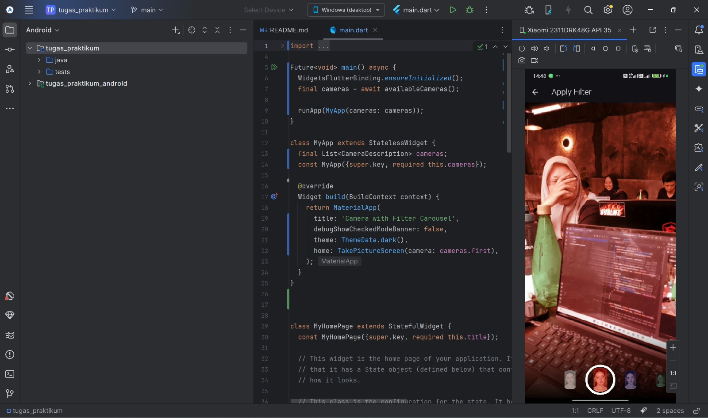
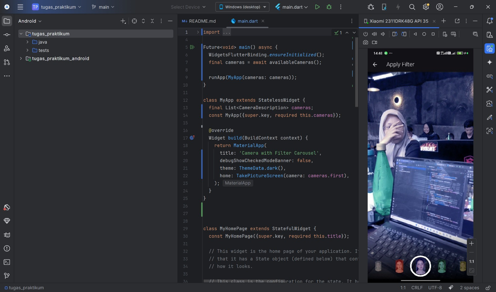

# Laporan Praktikum Jobsheet 9 - Kamera
Mampu  menggunakan plugin kamera di flutter

**Nama:** Oltha Rosyeda Al'haq
**NIM:** 2341720145 
**Mata Kuliah:** Mobile
**Dosen Pengampu:** Pak Agung

A new Flutter project.

## Getting Started

This project is a starting point for a Flutter application.

A few resources to get you started if this is your first Flutter project:

- [Lab: Write your first Flutter app](https://docs.flutter.dev/get-started/codelab)
- [Cookbook: Useful Flutter samples](https://docs.flutter.dev/cookbook)

For help getting started with Flutter development, view the
[online documentation](https://docs.flutter.dev/), which offers tutorials,
samples, guidance on mobile development, and a full API reference.

## Praktikum 1 : Mengambil Foto dengan Kamera di Flutter

### Langkah-Langkah
1. Buat Project Baru (kamera_flutter) 
2. Tambah dependensi yang diperlukan  
3. Ambil Sensor Kamera dari device
4. Buat dan inisialisasi CameraController
5. Gunakan CameraPreview untuk menampilkan preview foto
6. Ambil foto dengan CameraController
7. Buat widget baru DisplayPictureScreen 
8. Menampilkan hasil foto

### Dokumentasi Hasil

---

## Praktikum 2 : Membuat photo filter carousel

### Langkah-Langkah
1. Buat project baru (photo_filter_carousel)
2. Buat widget Selector ring dan dark gradient
3. Buat widget photo filter carousel
4. Membuat filter warna 
5. Implementasi filter carousel dan Troubleshoot

### Dokumentasi Hasil
Tambahkan screenshot hasil/output di bawah ini 👇  
Contoh:

---

## Tugas Praktikum
Pada tugas praktikum menggabungkan hasil praktikum 1 dengan hasil praktikum 2 sehingga setelah melakukan pengambilan foto, dapat dibuat filter carouselnya

### Langkah-Langkah
1. main.dart
Mulai dari kamera seperti di praktikum 1  
2. takepicture_screen.dart
Setelah foto diambil, bukan lagi DisplayPictureScreen, tapi PhotoFilterScreen.
3. Buat file baru → photo_filter_screen.dart
Menggabungkan konsep filter carousel dari praktikum 2, tapi foto-nya pakai file lokal hasil kamera.
4. filter_selector.dart, filter_item.dart, carousel_flowdelegate.dart
menggunakan kode yang sama dari praktikum 2

### Dokumentasi Hasil
Tambahkan screenshot hasil/output di bawah ini 👇  
Contoh:

---
