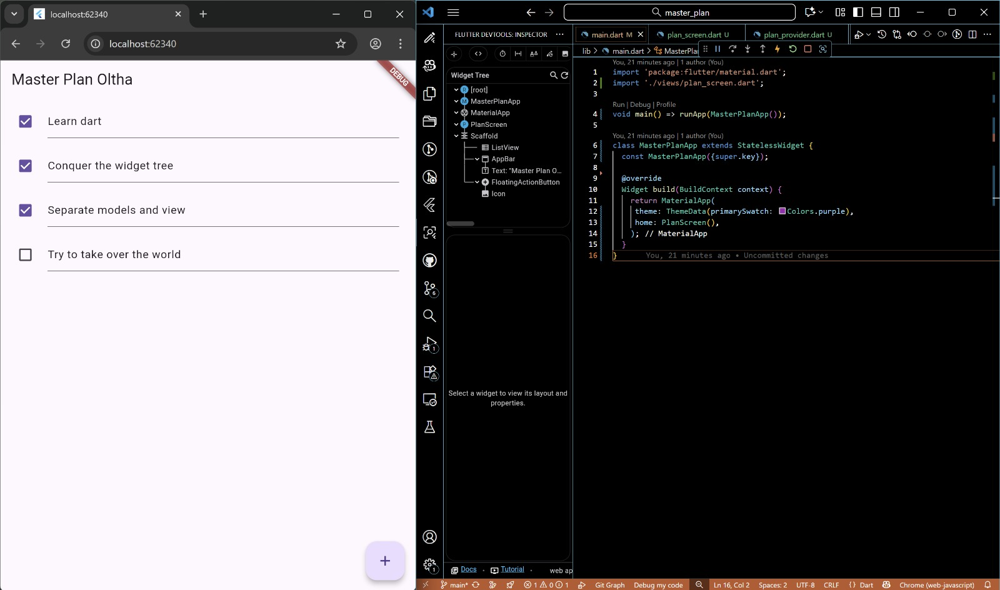
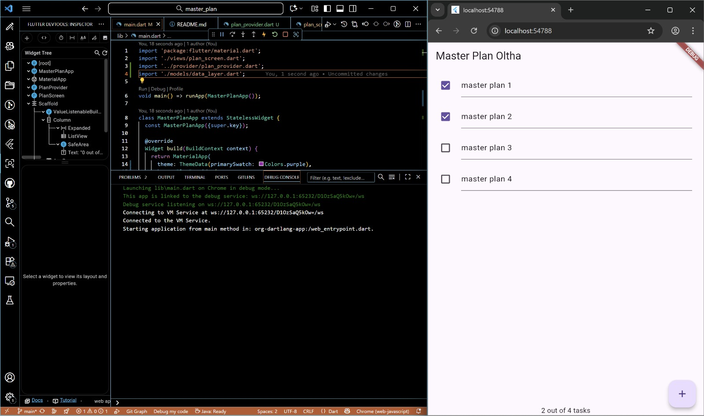
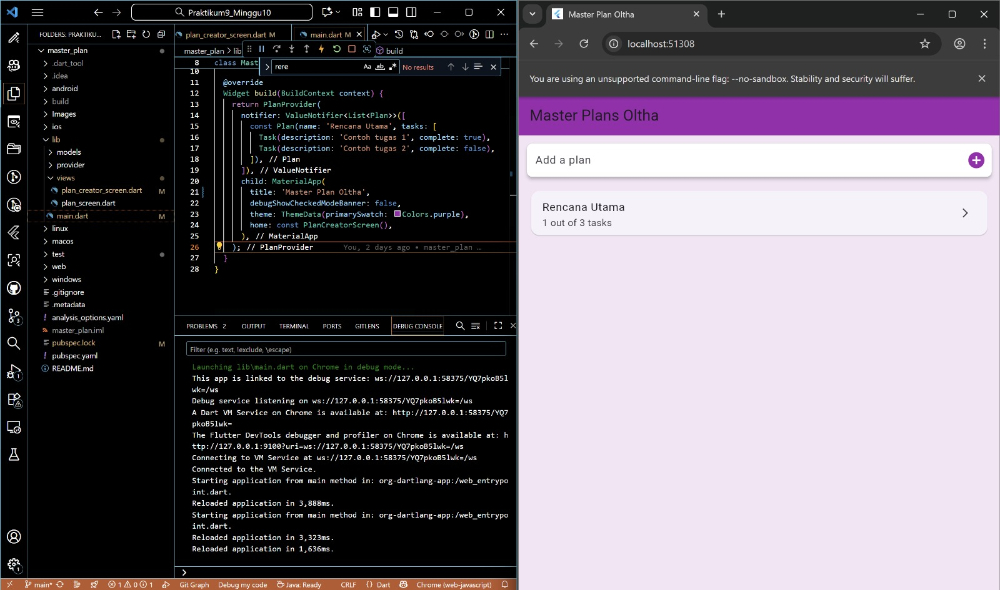
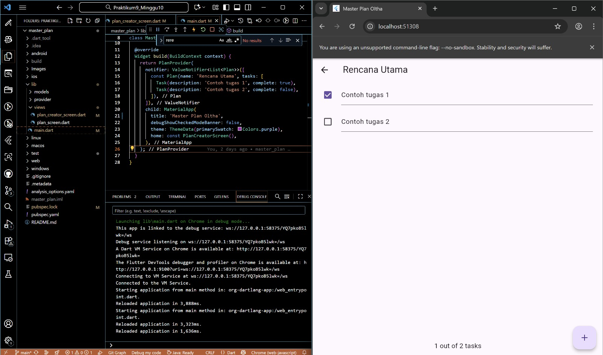

# master_plan

A new Flutter project.

## Getting Started

This project is a starting point for a Flutter application.

A few resources to get you started if this is your first Flutter project:

- [Lab: Write your first Flutter app](https://docs.flutter.dev/get-started/codelab)
- [Cookbook: Useful Flutter samples](https://docs.flutter.dev/cookbook)

For help getting started with Flutter development, view the
[online documentation](https://docs.flutter.dev/), which offers tutorials,
samples, guidance on mobile development, and a full API reference.

## Praktikum 1

Aplikasi Master Plan yang sudah bisa tampil dan berjalan normal, dengan daftar task yang bisa dicentang dan diedit. Ini adalah tampilan ketika state masih sederhana dan struktur kode masih fokus pada UI dasar. VSCode di sampingnya hanya memperlihatkan file dan widget tree yang masih menggunakan alur awal tanpa manajemen state yang kompleks.

### Soal
1. Jelaskan maksud dari langkah 4 pada praktikum tersebut! Mengapa dilakukan demikian?

Langkah 4 membuat file data_layer.dart bertujuan untuk menyederhanakan proses import pada aplikasi. Dengan mengumpulkan dan mengekspor semua model (seperti plan.dart dan task.dart) melalui satu file, developer cukup mengimpor satu berkas saja ketika membutuhkan semua model tersebut. Cara ini membuat struktur kode lebih rapi, mudah dikelola, dan memudahkan pengembangan ketika jumlah model bertambah, karena cukup menambahkan export baru pada satu file tanpa harus mengubah banyak bagian kode lain.

2. Mengapa perlu variabel plan di langkah 6 pada praktikum tersebut? Mengapa dibuat konstanta ?

Variabel plan dipakai karena halaman butuh satu objek Plan sebagai tempat menyimpan dan menampilkan daftar tugas. Objeknya dibuat const karena saat pertama kali dibuat datanya masih tetap, sehingga lebih efisien dan tidak perlu dibuat ulang setiap kali widget dibangun.

3. Apa kegunaan method pada Langkah 11 dan 13 dalam lifecyle state ?

Pada Langkah 11, initState() dipakai untuk menyiapkan apa pun yang harus berjalan sekali di awal, termasuk membuat ScrollController dan menambahkan listener. Listener itu dipakai agar saat daftar discroll, fokus keyboard otomatis hilang.

Pada Langkah 13, dispose() dipakai untuk membersihkan controller ketika widget sudah tidak dipakai lagi, supaya tidak ada kebocoran memori (memory leak).

## Praktikum 2

Aplikasi yang sudah memakai PlanProvider. Ini terlihat dari bagian bawah layar browser yang sudah menampilkan pesan “x out of y tasks”, yang berarti method pada model dan state-sharing sudah bekerja. Perubahan pada checkbox atau teks langsung memperbarui tampilan karena state Plan sekarang dikelola lewat ValueNotifier dan InheritedNotifier. VSCode juga terlihat sudah mengimpor plan_provider dan data_layer, menandakan aplikasi sudah berada pada tahap lanjutan dengan manajemen state yang benar.

### Soal
1. Jelaskan mana yang dimaksud InheritedWidget pada langkah 1 tersebut! Mengapa yang digunakan InheritedNotifier?

InheritedWidget yang dimaksud pada langkah 1 adalah PlanProvider itu sendiri, karena kelas tersebut mewarisi InheritedNotifier dan berfungsi sebagai widget yang membagikan data ke seluruh widget di bawahnya. Praktikum memakai InheritedNotifier karena selain membagikan data seperti InheritedWidget, ia juga otomatis memberi notifikasi ke widget lain ketika nilai Plan berubah, sehingga UI bisa memperbarui diri tanpa perlu setState di semua tempat.

2. Jelaskan maksud dari method di langkah 3 pada praktikum tersebut! Mengapa dilakukan demikian?

Kedua method itu dipakai untuk menghitung berapa tugas yang sudah selesai dan menampilkan ringkasannya dalam bentuk teks. Ini dilakukan supaya logika perhitungan tetap berada di dalam model Plan, bukan di UI, sehingga kode lebih rapi, mudah dipakai kembali, dan tampilan hanya tinggal memanggil hasilnya.

## Praktikum 3

Mengubah aplikasi dari yang hanya bisa mengelola satu rencana di satu layar, menjadi aplikasi yang mampu mengelola banyak rencana di dua layar terpisah dengan menggunakan PlanProvider sebagai sumber state tunggal yang dibagikan (State di Multiple Screens).

### Soal
1. Berdasarkan Praktikum 3 yang telah Anda lakukan, jelaskan maksud dari gambar diagram

Diagram tersebut menunjukkan perubahan pada Widget Tree (struktur hirarki widget di Flutter) yang terjadi ketika Anda berpindah dari satu layar ke layar lainnya menggunakan Navigator.push().

Pada awalnya, PlanCreatorScreen berada di bawah MaterialApp dan PlanProvider, yang menyimpan List<Plan> sebagai state bersama. Saat pengguna menavigasi ke PlanScreen dengan Navigator.push, layar baru muncul di atas stack, tapi PlanProvider tetap ada sehingga state yang sama bisa diakses. Setiap perubahan di PlanScreen otomatis memengaruhi PlanCreatorScreen karena keduanya menggunakan state yang sama. Dengan menempatkan state di atas kedua layar, data dapat dibagikan lintas layar sesuai prinsip "Lift State Up".

